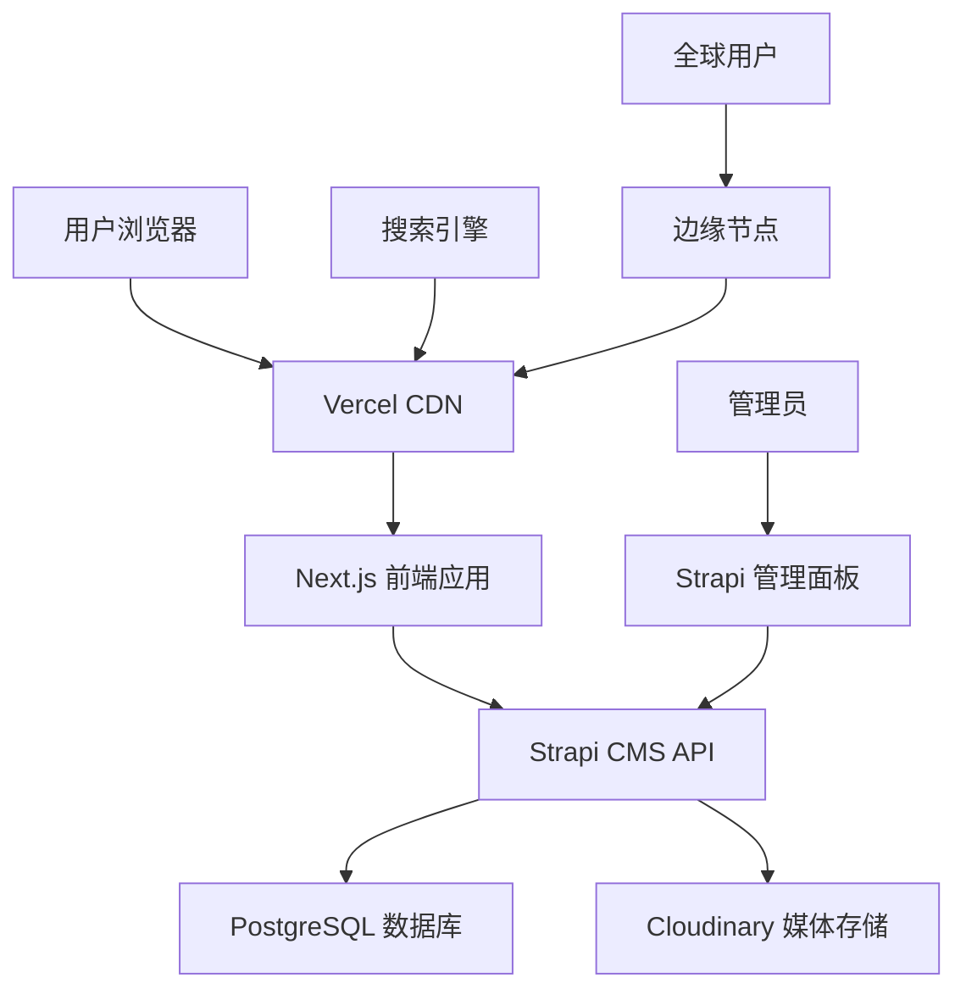

# 设计文档

## 概述

本设计文档详细描述了深圳联锦光电LED显示屏网站的现代化改造方案。该方案采用无头架构(Headless Architecture)，将现有的静态HTML网站升级为具有强大CMS后台管理功能的动态网站系统。

### 核心设计原则

1. **无头架构分离**: 前端展示与后端内容管理完全分离，提供最大的灵活性和可扩展性
2. **性能优先**: 通过SSR/SSG、CDN和优化策略确保全球访问速度
3. **SEO友好**: 内置SEO最佳实践，支持结构化数据和多语言SEO
4. **用户体验至上**: 响应式设计，直观的管理界面，流畅的用户交互
5. **安全可靠**: 企业级安全措施，数据保护和系统稳定性

## 架构

### 技术栈选择

**后端 (Headless CMS)**: Strapi v4
- 选择理由: 高度可定制的开源CMS，支持复杂数据模型，原生多语言支持
- 部署方式: Docker容器化部署，支持水平扩展
- 数据库: PostgreSQL (生产环境) / SQLite (开发环境)

**前端 (Frontend)**: Next.js 14 (基于React 18)
- 选择理由: 原生SSR/SSG支持，优秀的SEO性能，丰富的生态系统
- 渲染策略: 混合渲染 - 静态页面使用SSG，动态内容使用ISR
- 样式方案: Tailwind CSS + 自定义组件库

**部署架构**: 
- 前端: Vercel (全球CDN + 边缘计算)
- 后端: Railway/DigitalOcean (容器化部署)
- 媒体存储: Cloudinary (图片/视频CDN)

### 系统架构图



### 数据流架构

1. **内容创建流程**: 管理员通过Strapi管理面板创建/编辑内容 → 内容存储到数据库 → 触发Webhook → Next.js重新生成静态页面
2. **内容展示流程**: 用户访问页面 → Vercel CDN提供缓存内容 → 如需动态数据则调用Strapi API → 返回渲染页面
3. **多语言处理**: 基于URL路径(/zh/, /en/)的语言路由 → 从Strapi获取对应语言内容 → 渲染本地化页面

## 组件和接口

### 前端组件架构

#### 页面级组件
- `HomePage`: 首页主视觉和核心内容展示
- `ProductListPage`: 产品列表页面，包含筛选和分页
- `ProductDetailPage`: 产品详情页面，包含技术规格和相关案例
- `CaseStudiesPage`: 案例展示页面，支持多维度筛选
- `NewsPage`: 新闻列表和详情页面
- `ContactPage`: 联系页面，包含询盘表单

#### 通用组件库
- `Header`: 响应式导航栏，包含语言切换和移动端菜单
- `Footer`: 页脚信息和链接
- `ProductCard`: 产品卡片组件，支持多种布局
- `CaseStudyCard`: 案例卡片组件
- `NewsCard`: 新闻卡片组件
- `InquiryForm`: 询盘表单组件，包含验证和提交逻辑
- `LanguageSwitcher`: 语言切换组件
- `SEOHead`: SEO元数据管理组件

#### 功能组件
- `ProductFilter`: 产品筛选器，支持多维度筛选
- `ProductComparison`: 产品对比功能
- `MediaGallery`: 媒体画廊组件，支持图片/视频展示
- `TechnicalSpecs`: 技术规格表格组件
- `ContactMap`: 联系地图组件

### API接口设计

#### Strapi API端点

**产品相关**
- `GET /api/products` - 获取产品列表，支持筛选和分页
- `GET /api/products/:id` - 获取单个产品详情
- `GET /api/product-categories` - 获取产品分类

**案例相关**
- `GET /api/case-studies` - 获取案例列表
- `GET /api/case-studies/:id` - 获取单个案例详情

**新闻相关**
- `GET /api/news` - 获取新闻列表
- `GET /api/news/:id` - 获取单个新闻详情

**页面内容**
- `GET /api/pages/:slug` - 获取页面内容
- `GET /api/global-settings` - 获取全局设置

**询盘相关**
- `POST /api/inquiries` - 提交询盘表单
- `GET /api/inquiries` - 获取询盘列表(管理员)

#### 前端API路由

**页面路由**
- `/[locale]` - 首页 (支持 /zh, /en)
- `/[locale]/products` - 产品列表
- `/[locale]/products/[category]` - 产品分类页
- `/[locale]/products/[category]/[slug]` - 产品详情
- `/[locale]/case-studies` - 案例列表
- `/[locale]/case-studies/[slug]` - 案例详情
- `/[locale]/news` - 新闻列表
- `/[locale]/news/[slug]` - 新闻详情
- `/[locale]/contact` - 联系页面

**API路由**
- `/api/contact` - 处理联系表单提交
- `/api/revalidate` - 处理内容更新的重新验证
- `/api/sitemap.xml` - 动态生成站点地图

## 数据模型

### Strapi 内容类型定义

#### Product (产品)
```javascript
{
  name_zh: "String (必填)",
  name_en: "String (必填)", 
  slug: "UID (基于name_en)",
  category: "Relation (产品分类)",
  description_zh: "RichText",
  description_en: "RichText",
  images: "Media (多个)",
  videos: "Media (多个)",
  technicalSpecs: "JSON (技术规格)",
  features_zh: "JSON (产品特性)",
  features_en: "JSON (产品特性)",
  applications: "Relation (应用场景)",
  relatedCases: "Relation (相关案例)",
  brochures: "Media (产品手册)",
  seoTitle_zh: "String",
  seoTitle_en: "String", 
  seoDescription_zh: "Text",
  seoDescription_en: "Text",
  publishedAt: "DateTime",
  createdAt: "DateTime",
  updatedAt: "DateTime"
}
```

#### CaseStudy (项目案例)
```javascript
{
  title_zh: "String (必填)",
  title_en: "String (必填)",
  slug: "UID",
  client: "String (客户名称)",
  location: "String (项目地点)",
  industry: "Enumeration (行业分类)",
  challenge_zh: "RichText (挑战描述)",
  challenge_en: "RichText",
  solution_zh: "RichText (解决方案)",
  solution_en: "RichText", 
  results_zh: "RichText (项目成果)",
  results_en: "RichText",
  images: "Media (多个)",
  videos: "Media (多个)",
  productsUsed: "Relation (使用的产品)",
  projectDate: "Date",
  featured: "Boolean (是否推荐)",
  seoTitle_zh: "String",
  seoTitle_en: "String",
  seoDescription_zh: "Text", 
  seoDescription_en: "Text"
}
```

#### News (新闻资讯)
```javascript
{
  title_zh: "String (必填)",
  title_en: "String (必填)",
  slug: "UID",
  excerpt_zh: "Text (摘要)",
  excerpt_en: "Text",
  content_zh: "RichText (正文)",
  content_en: "RichText",
  featuredImage: "Media",
  category: "Enumeration (新闻分类)",
  tags: "JSON (标签)",
  author: "String",
  publishDate: "DateTime",
  featured: "Boolean",
  seoTitle_zh: "String",
  seoTitle_en: "String",
  seoDescription_zh: "Text",
  seoDescription_en: "Text"
}
```

#### Inquiry (询盘)
```javascript
{
  name: "String (必填)",
  email: "Email (必填)",
  phone: "String",
  company: "String",
  country: "String",
  projectType: "Enumeration",
  industry: "Enumeration", 
  budget: "Enumeration",
  timeline: "Enumeration",
  requirements: "Text (详细需求)",
  attachments: "Media (多个)",
  status: "Enumeration (待处理/已联系/已完成)",
  assignedTo: "Relation (分配给销售)",
  notes: "Text (内部备注)",
  submittedAt: "DateTime",
  followUpDate: "DateTime"
}
```

#### GlobalSettings (全局设置)
```javascript
{
  siteName_zh: "String",
  siteName_en: "String",
  siteDescription_zh: "Text",
  siteDescription_en: "Text", 
  contactInfo: "JSON (联系信息)",
  socialMedia: "JSON (社交媒体)",
  certifications: "Media (认证图片)",
  companyVideo: "Media",
  seoSettings: "JSON (全局SEO设置)"
}
```

## 错误处理

### 前端错误处理策略

1. **页面级错误边界**: 使用React Error Boundary捕获组件错误，显示友好的错误页面
2. **API调用错误**: 实现重试机制和降级策略，确保用户体验不受影响
3. **404处理**: 自定义404页面，提供搜索和导航建议
4. **网络错误**: 离线检测和网络状态提示

### 后端错误处理

1. **API错误响应**: 标准化的错误响应格式，包含错误代码和描述
2. **数据验证**: 严格的输入验证和数据清理
3. **日志记录**: 详细的错误日志和监控告警
4. **备份恢复**: 自动数据备份和灾难恢复机制

## 测试策略

### 前端测试

1. **单元测试**: Jest + React Testing Library，覆盖核心组件和工具函数
2. **集成测试**: 测试组件间交互和API集成
3. **E2E测试**: Playwright，测试关键用户流程
4. **性能测试**: Lighthouse CI，确保性能指标达标
5. **可访问性测试**: axe-core，确保WCAG 2.1 AA标准合规

### 后端测试

1. **API测试**: 使用Strapi内置测试框架测试API端点
2. **数据模型测试**: 验证数据关系和约束
3. **权限测试**: 测试基于角色的访问控制
4. **负载测试**: 模拟高并发访问，确保系统稳定性

### 测试自动化

1. **CI/CD集成**: GitHub Actions自动运行测试套件
2. **部署前验证**: 自动化的部署前检查和验证
3. **监控告警**: 生产环境的实时监控和异常告警

## 安全考虑

### 前端安全

1. **内容安全策略(CSP)**: 防止XSS攻击
2. **HTTPS强制**: 全站HTTPS加密传输
3. **敏感信息保护**: 环境变量管理，避免敏感信息泄露

### 后端安全

1. **身份认证**: JWT令牌认证，支持角色权限控制
2. **数据验证**: 严格的输入验证和SQL注入防护
3. **API限流**: 防止恶意请求和DDoS攻击
4. **数据加密**: 敏感数据加密存储

### 部署安全

1. **环境隔离**: 开发、测试、生产环境完全隔离
2. **访问控制**: 基于IP和角色的访问限制
3. **安全更新**: 定期的安全补丁和依赖更新
4. **备份加密**: 数据备份的加密存储

## 性能优化

### 前端性能

1. **代码分割**: 基于路由的代码分割，减少初始加载时间
2. **图片优化**: Next.js Image组件，自动WebP转换和响应式图片
3. **缓存策略**: 静态资源长期缓存，API响应适度缓存
4. **预加载**: 关键资源预加载和预取

### 后端性能

1. **数据库优化**: 索引优化，查询性能调优
2. **API缓存**: Redis缓存热点数据
3. **CDN加速**: 全球CDN分发，就近访问
4. **压缩传输**: Gzip/Brotli压缩，减少传输大小

### 监控指标

1. **Core Web Vitals**: LCP < 2.5s, FID < 100ms, CLS < 0.1
2. **API响应时间**: 平均响应时间 < 200ms
3. **可用性**: 99.9%的服务可用性
4. **错误率**: 错误率 < 0.1%